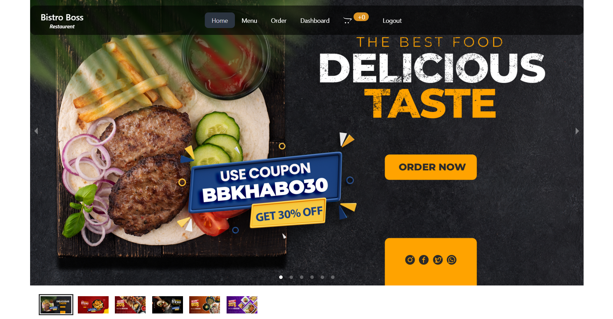

# Bistro Boss

#
Bistro Boss is a modern restaurant management web application that provides users with an interactive menu, order placement, and a streamlined admin panel for restaurant operations.

## Features

### **User Features**:
- Browse, search, and filter food items.
- Add items to the cart and place orders.
- Secure authentication using Firebase.
- View order history and ratings.
- Interactive parallax and animation effects.

### **Admin Features**:
- Add, update, and delete menu items.
- Manage customer orders efficiently.
- Track sales and revenue using charts.
- Role-based authentication for security.

## Technologies Used

### **Frontend**
- **React** – Component-based UI development.
- **React Router** – Navigation and routing.
- **Tailwind CSS & DaisyUI** – Modern and responsive styling.
- **Framer Motion** – Smooth animations.
- **Axios** – API requests handling.
- **React Query** – Data fetching and caching.
- **Recharts** – Data visualization.
- **SweetAlert2** – Elegant alert dialogs.
- **Swiper & React Parallax** – Interactive UI effects.

### **Backend**
- **Node.js & Express.js** – Server-side logic.
- **MongoDB** – Database for storing user and order data.
- **Firebase Authentication** – Secure login and signup.
- **Stripe** – Payment gateway for transactions.

## npm Packages Used

### **Core Dependencies**
- `@tanstack/react-query`: Data fetching and state management.
- `axios`: API communication.
- `firebase`: Authentication & database integration.
- `react-router-dom`: Navigation and routing.
- `react-hook-form`: Form validation and handling.
- `react-tabs`: Tabbed navigation system.
- `react-responsive-carousel`: Image sliders.
- `react-simple-captcha`: User verification.

### **UI & Animations**
- `motion`: Smooth UI animations.
- `react-parallax`: Stunning parallax effects.
- `react-spinners`: Stylish loading animations.
- `sweetalert2`: Beautiful alerts and notifications.
- `swiper`: Modern sliders for images and content.
- `recharts`: Interactive charts for data visualization.
- `animate.css`: Pre-built animation styles.

### **Development Tools**
- `vite`: Fast development server.
- `tailwindcss` & `daisyui`: Modern styling framework.
- `eslint`: Code linting and formatting.
- `postcss`: CSS processing and optimization.

## Live Website

- [Bistro Boss](https://bistro-boss-cb65e.web.app/)

## ⚙️ Installation

To run Bistro Boss locally, follow these steps:  
##

### 1️⃣ Clone the Repository  
- git clone https://github.com/surayaahlam/bistro-boss-client.git
- cd bistro-boss-client

### 2️⃣ Install Dependencies
- npm install  

### 3️⃣ Set Up .env.local
- VITE_apiKey=your_firebase_api_key
- VITE_authDomain=your_firebase_auth_domain
- VITE_projectId=your_firebase_project_id
- VITE_storageBucket=your_firebase_storage_bucket
- VITE_messagingSenderId=your_firebase_messaging_sender_id
- VITE_appId=your_firebase_app_id
- VITE_PAYMENT_GATEWAY_PK=your_stripe_publishable_key

### 4️⃣ Start the Development Server
- npm run dev

